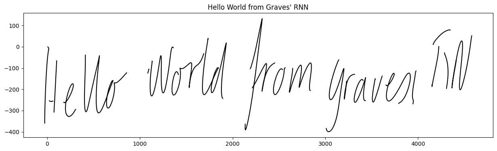
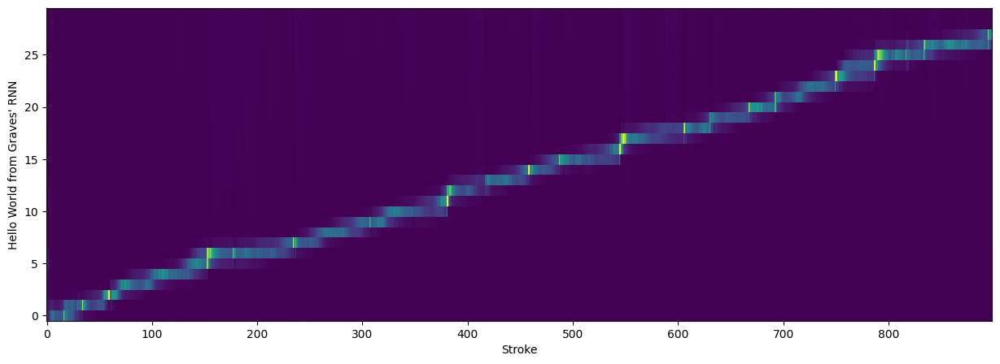

# More than meets the eye! Transfomers that write.
Replication of Grave's 2013 hand-writing synthesis work, but with modern AI and a Transformer model

Here is the first writing:

It seems to like printing for some reason.
Update 22/10/16 - I have played around with the network extensively now, trying the pre-norm version, squared-relu, and 
and learning rate schedule, but it always seems to narrow in on the printing. It does a very good job at it, but I don't think it's learning a mixture density, just simply the most simple printing that separates the letters more fully into tokens. It has a hard time with 'fuzzy' writing or multiple writers. I'm not sure why yet.

I also implemented Graves' 2014 paper fully in JAX in the attached notebook. I could only get to about -941 nats, but I didn't do a lot of fine-tuning and I did make some small changes. I also only trained it for about 1/2 day on an A100-SXM4-40GB, which is quite an improvement from 8 years ago.

Here is the output from the RNN for comparison (900 strokes):

And here are the phis (the attention alignment), replicating Graves' 2014 Fig. 13:

Anyway, the code is ugly. Time to refactor and play around.

TODO:
* Refactor code
* Add checkpoints
* Add attention-weights - custom MHA
* Try out a softmax distribution instead of mixture density
* Add a token of some kind that identifies the writer so we can see a distribution of styles
* Figure out how to prime the network to write in a certain style.
* Move to a PerceiverAR style network for longer sequences and latent spaces
* Try learned positional encodings instead of sinusodial
* Try different learning schedules
